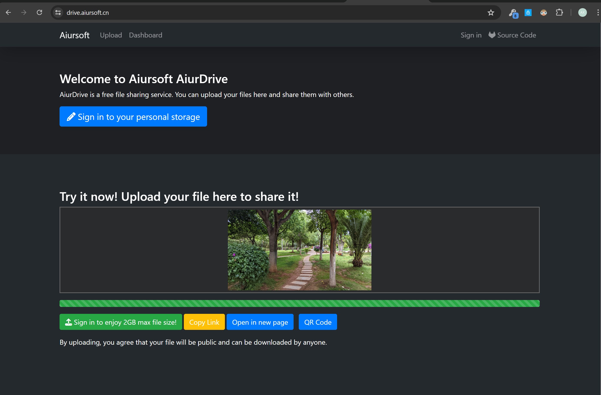

# AiurDrive

[](https://gitlab.aiursoft.com/aiursoft/aiurdrive/-/blob/master/LICENSE)
[](https://gitlab.aiursoft.com/aiursoft/aiurdrive/-/pipelines)
[](https://gitlab.aiursoft.com/aiursoft/aiurdrive/-/pipelines)
[](https://gitlab.aiursoft.com/aiursoft/aiurdrive/-/commits/master?ref_type=heads)
[](https://drive.aiursoft.cn)
[](https://hub.docker.com/r/aiursoft/aiurdrive)

AiurDrive is a free file sharing service. You can upload your files here and share them with others.



## Try

Try a running AiurDrive [here](https://drive.aiursoft.cn).

## Run in Ubuntu

The following script will install\update this app on your Ubuntu server. Supports Ubuntu 25.04.

On your Ubuntu server, run the following command:

```bash
curl -sL https://gitlab.aiursoft.com/aiursoft/aiurdrive/-/raw/master/install.sh | sudo bash
```

Of course it is suggested that append a custom port number to the command:

```bash
curl -sL https://gitlab.aiursoft.com/aiursoft/aiurdrive/-/raw/master/install.sh | sudo bash -s 8080
```

It will install the app as a systemd service, and start it automatically. Binary files will be located at `/opt/apps`. Service files will be located at `/etc/systemd/system`.

## Run manually

Requirements about how to run

1. Install [Docker](https://www.docker.com/)
2. Run `sudo docker build -t debug .` in the project path to build the image from source.
3. Run `sudo docker run -it -p 5000:5000 -v /tmp:/tmp -v /var/run/docker.sock:/var/run/docker.sock debug` in the project path.
4. Open `http://localhost:5000` in your browser to test the app.

## Run in Docker

First, install Docker [here](https://docs.docker.com/get-docker/).

Then run the following commands in a Linux shell:

```bash
image=aiursoft/aiurdrive
appName=aiurdrive
sudo docker pull $image
sudo docker run -d --name $appName --restart unless-stopped -p 5000:5000 -v /var/www/$appName:/data $image
```

That will start a web server at `http://localhost:5000` and you can test the app.

The docker image has the following context:

| Properties  | Value                              |
|-------------|------------------------------------|
| Image       | aiursoft/aiurdrive                 |
| Ports       | 5000                               |
| Binary path | /app                                           |
| Data path   | /data                                          |
| Config path | /data/appsettings.json                         |
| Passthrough | /var/run/docker.sock (For Docker)              |
| Passthrough | /tmp (For saving the unprocessed images)       |

## How to contribute

There are many ways to contribute to the project: logging bugs, submitting pull requests, reporting issues, and creating suggestions.

Even if you with push rights on the repository, you should create a personal fork and create feature branches there when you need them. This keeps the main repository clean and your workflow cruft out of sight.

We're also interested in your feedback on the future of this project. You can submit a suggestion or feature request through the issue tracker. To make this process more effective, we're asking that these include more information to help define them more clearly.
